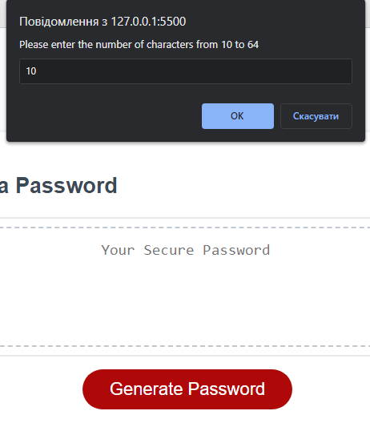
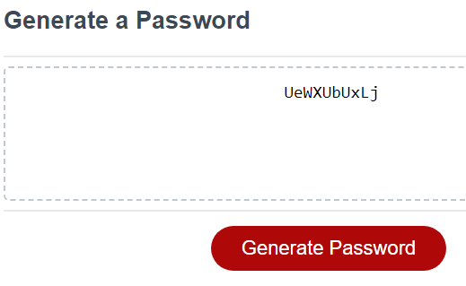

# Password-Generator
Creating password generator based on user's selection.

## Description
This project was basically aimed to learn and implement how to generate a password based on criteria of user's selection. Among the assets given (HTML, SCC, JS) the changes should have been applied only to JavaScript, mainly by practicing functions. The main point of this project was to generate a password after a user answered simple questions about what should be included to the password itself and clicked a button "Generate password". This is one of the ways how to create a quick password.

### Instalation
N/A

### Usage
First of all, creating a password is very common in using different websies. That is why, the Password Generator becomes very handy. In this particular project, to make it work best for the user, 5 different prompts were written to ask the user how many characters must be included to the password between 10 and 64 and exactly what characters should be in - uppercased, lowercased, number or maybe special characters. After specifing the criteria and clicking the button "Generate password" a function picks random characters from lists chosen and generates password into the "Your Secure Password" area on the screen.

Generally, it looks like this:

### Credits
N/A

### License
Please refer to the LICENSE in the repo.

This project was deployed at GitHub Pages: https://sashak2609.github.io/Password-Generator-Project/
